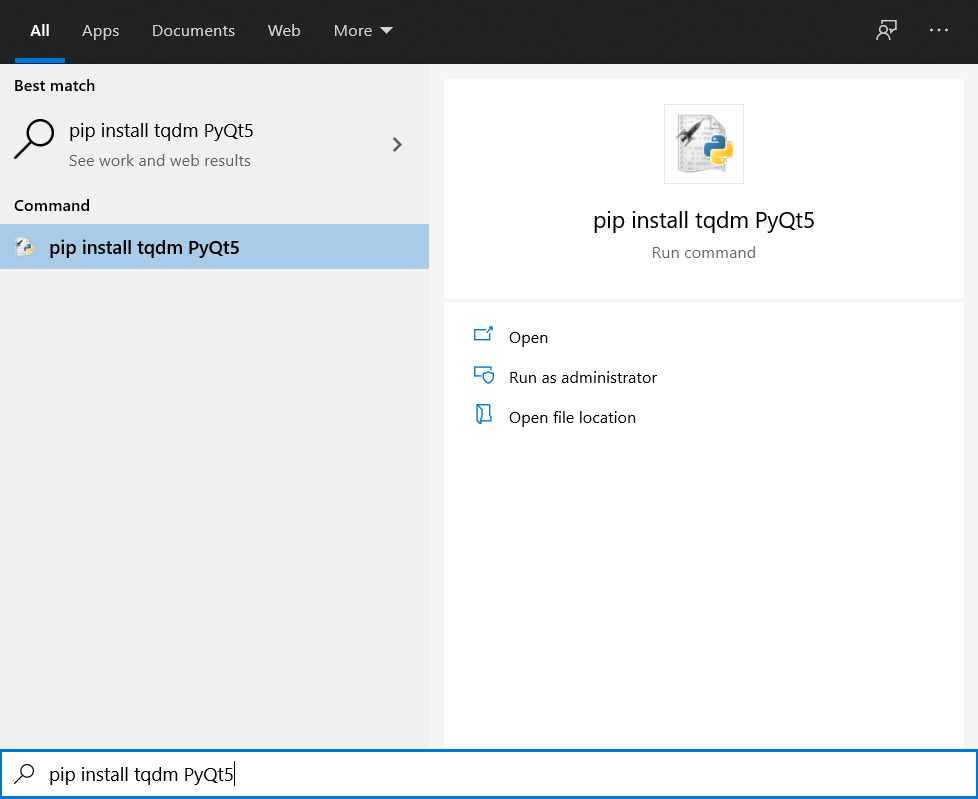

# Safe Mover with GUI


## Installation

Use the package manager [pip](https://pip.pypa.io/en/stable/) to install necessary packages. 

```bash
pip install tqdm PyQt5
```

## Usage
### With command line
`python3 mover.py source=<source path> dest=<dest path> logs=<log folder path> checksum=<checksum> checkDuplicate=<True|False> filenameClean=<True|False> exclusive=''`
- If path contains space, add `\`(unix) or `/`(windows) before space.
- Available checksume algorithms: md5, sha1, sha224, sha256, sha384, sha512, blake2b, blake2s.
- Default value: logs=logs, checksum=md5, checkDuplicate=False, filenameClean=True
- Example: `python3 mover.py source=/home/test dest=/home/test1 logs=/home/logs checksume=md5 checkDuplicate=False filenameClean=True` if the parameters are not set, default value will be used.
### With GUI
- Double click `SafeMoverGUI.py` to open as python application. 
- Choose checksum method.
- Input path or click folder icon 📁 to select source/dest/logs folder/file. 
- Click 'Copy' button to start the process, the processing log will show on the right side and progress bar will show progress percentage. 
- If you want to terminate the process, just click the 'Cancel' button to stop it, the destination folder/file and log file will be removed, be awared if your are overwriting destination folder, it will remove all of them.

You can open log.csv to review the details of the moving records. 


## Todo
- ~~On/Off - filename cleaning (currently on)~~
- ~~On/Off - exclude files~~
- Multithread moving files
- ~~Retry when failed~~
- Deploy mover.py into Pypi, then SafeMoverGUI.py can run independently
- ~~Identify duplication~~

## Contributing
Pull requests are welcome. For major changes, please open an issue first to discuss what you would like to change.

Please make sure to update tests as appropriate.

## License
[GNU General Public License v2.0](https://choosealicense.com/licenses/gpl-2.0/)